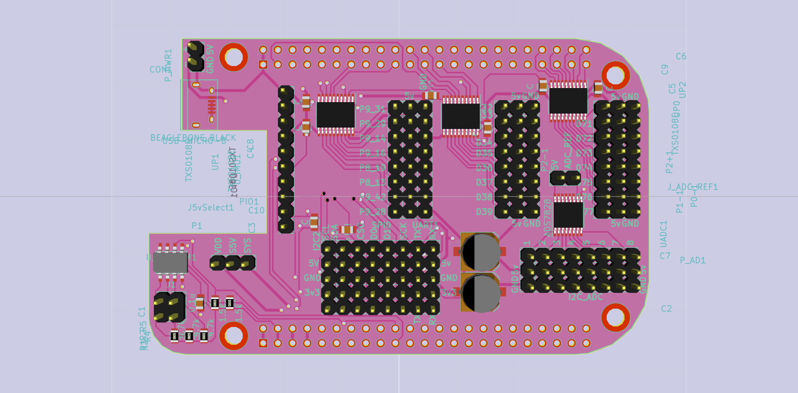

# IO Cape
### A simple BeagleBone Black Cape extending the pwm and GPIO pins with an i2c ADC chip for 5V ADC input (ADS7828) in KiCad

This board also has a connection designed for a proprietary 9 axis board using Bosch BMX055 using i2c interface

## Pin Mapping
|   Name    |   BeagleBone Pin ID   | GPIO  	|
|-----------|-----------------------|-----------|
|	D70		|	P8_45				|GPIO2_6	|
|	D71		|	P8_46				|GPIO2_7	|
|	D72		|	P8_43				|GPIO2_8	|
|	D73		|	P8_44				|GPIO2_9	|
|	D74		|	P8_41				|GPIO2_10	|
|	D75		|	P8_42				|GPIO2_11	|
|	D76		|	P8_39				|GPIO2_12	|
|	D77		|	P8_40				|GPIO2_13	|
